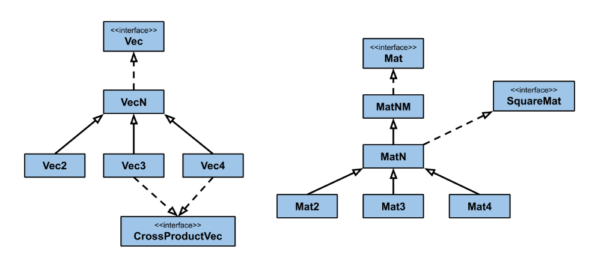

# Java Graphics Math Library
**Author**: Jordan Pottruff

The Java Graphics Math Library (JGML) encapsulates important graphics-related mathematics into
various matrix and vector implementations. This makes it easier to program graphics-related software
in the Java language.

## Overview


JGML provides multiple implementations of both vectors and matrices. These implementations primarily
differ by how the dimensions of the object are defined. While highly generalized classes like 
`MatMN` and `VecN` could be exclusively used, certain functionality requires strict guarantees about
the exact dimension of the vector or matrix. Therefore, various dimension-specific classes exist 
within an intuitive inheritance structure.

The primary advantage of this library is the guarantee it provides about object immutability. All 
vector and matrix classes have *deep immutability*, making them safe for use in concurrent 
programming. In addition, mutable versions are available in some classes using the *builder 
pattern*. 

### Vectors
The bare minimum requirements for a vector object are specified by the `Vec` interface. This 
interface describes the basic functionality of vector objects, such as methods for getting the 
magnitude, computing the normalized form, and performing addition, multiplication (dot product), 
etc.

The `VecN` class represents a generalized vector. That is, a vector with some dimension N. The only
hard limit placed on this generalized implementation is that the dimension be at least 2. This 
class meets the bare minimum requirements defined by the `Vec` interface.

The `Vec2`, `Vec3`, and `Vec4` classes are the dimension-specific vector definitions, and are 
subclasses of `VecN`. The most important benefit of using these specific vector classes is that
their overridden operations (methods) return a more specific class. For example, `VecN`'s dot 
product method, `multiply(Vec vec)`, returns a `VecN` object. However, `Vec4` overrides this 
method to return the product as a `Vec4`, since the result of a successful addition with a 
4-dimensional vector has to return a 4-dimensional vector as well. 

Some methods, such as accessors to the x, y, z, etc coordinates or the cross product operations 
only apply to vectors of a certain dimension. Therefore, it is recommended that you use the most
specific vector type that you can in order to provide as much flexibility as possible.

### Matrices
The bare minimum requirements for a matrix object are specified by the `Mat` interface. This 
interface describes the basic functionality of matrix objects, such as methods for getting the 
columns/row vectors or operations like addition, multiplication, etc.

The `MatMN` class represents the most generalized matrix possible. Specifically, it represents a 
matrix of some dimension M by N. Similar to `VecN`, the only hard limit imposed on these dimensions
is that they be at least 2. This class meets the bare requirements defined by the `Mat` interface.

The `MatN` class is a subclass of `MatMN` and represents a generalized square matrix of dimension N 
by N. It provides the implementation of operations that are specific to square matrices, such as 
calculating the determinant or inverse matrix.

The `Mat2`, `Mat3`, and `Mat4` classes are the dimension-specific matrix definitions, and are 
subclasses of `MatN`. Like the dimension-specific vectors, these provide useful overrides of 
`MatN` methods that modify the return type to use dimension-specific matrix classes. 

#### Transformations

Square matrices are incredibly common in graphical applications. Often, they are used to represent
*affine transformations* in different dimensions. To make it easier to build useful transformations,
each dimension-specific class provides a `TransformBuilder` inner-class that constructs a matrix
out of a sequence of rotation, scaling, translation, and shearing transformations. 

## Examples

### Vectors
````java
double[] array = new double[]{10.0, 9.0, 8.0};

// Some ways to create vector objects:
Vec3 vec3A = new Vec3(1.0, 2.0, 3.0);  // <1.0, 2.0, 3.0>
Vec3 vec3B = new Vec3(array);          // <10.0, 9.0, 8.0> 
Vec4 vec4A = new Vec4(vecA, 4.0);      // <1.0, 2.0, 3.0, 4.0>
Vec4 vec4B = new Vec4(vecB);           // <1.0, 2.0, 3.0, 4.0> (new object)

// Some operations:
double mag = vec3A.magnitude();        // 3.74...
Vec3 norm = vec3A.normalize();         // <0.27..., 0.53...., 8.80...>
Vec3 sum = vec3A.add(vec3B);           // <11.0, 11.0, 11.0>
double dot = Vec3A.multiply(vec3B);    // 52.0
Vec3 cross = vec3A.cross(vec3B);       // <-11.0, 22.0, -11.0>

// Other functionality:
double[] arrayVec3A = vec3A.toArray(); // {1.0, 2.0, 3.0}
double xVec3A = vec3A.x();             // 1.0
````

### Matrices
````java
double[][] array2D = new double[][]{{1.0, 2.0}, {3.0, 4.0}};

// Some ways to create matrix objects:
Mat2 mat2A = new Mat2(array2D);
// [1.0][3.0]
// [2.0][4.0]
Mat2 mat2B = new Mat2(new Vec2(10.0, 5.0), new Vec2(3.0, 12.0));
// [10.0][ 3.0]
// [ 5.0][12.0] 
Mat2 mat2C = new Mat2(mat2B);
// [10.0][ 3.0]
// [ 5.0][12.0] 
// (new object)

// Some operations:
double det = mat2A.determinant();      // -2.0
Mat2 inverse = mat2A.inverse();
// [-2.0][ 1.5]
// [ 1.0][-0.5]
Mat2 sum = mat2A.add(mat2B);
// [11.0][ 6.0]
// [ 7.0][16.0]
Mat2 product = mat2A.multiply(mat2B);
// [25.0][39.0]
// [40.0][54.0]
Vec2 aVec = new vec2(1.0, 3.0);
Vec2 vecMult = mat2A.multiply(aVec);   // <10.0, 14.0>

// Other functionality:
double elem = mat2A.get(0, 1);         // 3.0
Vec2 col = mat2A.getCol(0);            // <1.0, 2.0>
Vec2 row = mat2A.getRow(1);            // <5.0, 12.0>
double[][] arrayMat2A = mat2A.toArray();
// {{1.0, 2.0}, {3.0, 4.0}}
````

### Transformations
````java
Mat4 rotate = new Mat4.TransformBuilder().rotateX(Math.PI).build();
Mat4 translate = new Mat4.TransformBuilder().translateX(10.0).build();
Mat4 scale = new Mat4.TransformBuilder().scaleX(100.0).build();
Mat4 shear = new Mat4.shearX(10.0, 12.0).build();

// Operations can be chained too. Here is an example of rotating a point around another:
Vec4 pointToRotate = new Vec3(1.0, 2.0, 3.0, 1.0);
Vec4 pointToRotateAround = new Vec3(10.0, 2.0, 0.0, 1.0);

Mat4 chain = new Mat4.TransformBuilder()
                .translate(pointToRotateAround.invert())
                .rotateX(Math.PI/2.0)
                .translate(pointToRotateAround)
                .build();

Vec4 rotatedPoint = chain.multiply(pointToRotate);
````